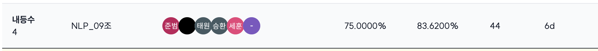
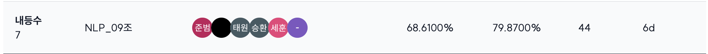

# MRC (Machine Reading Comprehension) Project
네이버 부스트 캠프 AI-Tech 8기에서 진행한 NLP 도메인의 첫번째 팀 경진대회입니다. 
- 기간 : 2025.12.01(월) - 2025.12.11(목)

## 👩‍🏫 대회 소개
Question Answering (QA)은 다양한 종류의 질문에 대해 대답하는 인공지능을 만드는 연구 분야입니다.
다양한 QA 시스템 중, Open-Domain Question Answering (ODQA) 은 주어지는 지문이 따로 존재하지 않고 사전에 구축되어있는 Knowledge resource 에서 질문에 대답할 수 있는 문서를 찾는 과정이 추가되기 때문에 더 어려운 문제입니다.
 
본 ODQA 대회에서 우리가 만들 모델은 two-stage로 구성되어 있습니다. 첫 단계는 질문에 관련된 문서를 찾아주는 "retriever" 단계이고, 다음으로는 관련된 문서를 읽고 적절한 답변을 찾거나 만들어주는 "reader" 단계입니다. 두 가지 단계를 각각 구성하고 그것들을 적절히 통합하게 되면, 어려운 질문을 던져도 답변을 해주는 ODQA 시스템을 여러분들 손으로 직접 만들어 보는것이 목표입니다.

## 👨‍👦‍👦 팀 소개
### 팀 이름
파란 부스터 (nlp 9조)
### 팀원
| 김민석 | 강다형 | 박준범 | 이태원 | 김세훈 | 허승환 |
| --- | --- | --- | --- | --- | --- |

### 역할
| 이름 | 역할  |
| :-: | --- |
| **김민석** | Retrieval 모델 리서치 및 실험(DPR), 데이터 증강(negative sampling) | 
| **강다형** | 베이스라인 코드 재설계, 실험관리 인프라 설정, Retrieval 모델 리서치 및 실험(sparse+dense), Github 관리 |
| **박준범** | MRC 모델 리서치 및 실험, Retrieval 모델 리서치 및 실험(Reranking) |
| **이태원** | MRC 모델 리서치 및 실험, 하이퍼파라미터 튜닝, 데이터 후처리, tapt, 앙상블 |
| **김세훈** | EDA, 데이터 전처리, 데이터 후처리,  데이터 증강(negative Sampling) |
| **허승환** | EDA, 앙상블 |

## ⚙ 환경
- GPU : V100 32GB 3대
- 협업 : Github, Notion, Slack

## 📆 타임 라인

## 📃 주요 구현 기능
### Reader
기존 train context에 negative sample을 생성하여 shuffle후 새로운 데이터셋 구축 후 curriculum 학습 
- BM25 -> bi-encoder -> cross-encoder 순서로 유사도 기반 negative sample 생성
- 문장 순서 랜덤 shuffle 후 answer_start 오프셋 재계산후 데이터 셋 재구축
- curriculum 학습
### Retriever
BM25(sparse) + dense의 hybrid score로 top-k 문서 선별
- 기존 SOTA 모델 사용
- BM25알고리즘 점수와 결합
- rerank 적용
### Ensemble
- oceann2
- roberta2
- hanteck2
- uomnf2 
### 상세 실험 내용
- [랩업 리포트](https://github.com/boostcampaitech8/pro-nlp-mrc-nlp-09/blob/main/docs/MRC_NLP-09.pdf)   

## 🏆 최종 성적
- **Public 순위** : **4위** (EM : 75% / F1 : 83.62%) / 16팀

- **Private 순위** : **7위** (EM : 68.6100% / 79.87%) / 16팀

## 📁 구조 소개

